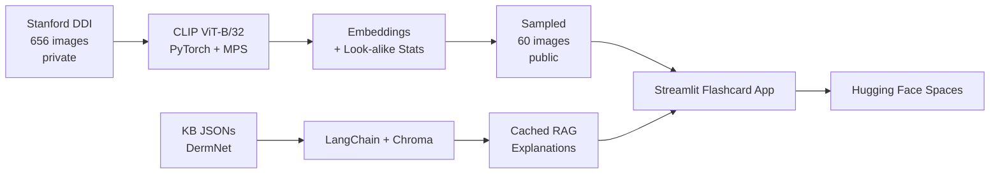

# SkinSight AI: Visual Dermatology Learning
>  SkinSight AI is an interactive study tool that helps students learn to visually diagnose skin conditions with more diverse representation than typical materials. It pairs CLIP visual similarity (to determine lookalike-based distractors) with RAG over DermNet (for grounded explanations).

**Web application:** https://madwall-skin-sight-website.hf.space/


## Project Motivation
Dermatology education materials underrepresent black and brown skin tones — a recent study found that only **10%** of images feature skin of color (Tadesse et al.). This may limit students' ability to diagnosis conditions, since most teaching has relied on lighter skin tone presentations (Kaundinya & Kundu). 

## What it Does
SkinSight AI offers two features: **flashcards** for diagnostic practice and a **live RAG chat** for asking questions grounded in clinical documents. Under the hood, a frozen CLIP ViT-B/32 image encoder embeds each DDI image into a 512-dim vector. This lets us use feature extraction to find the top-2 visually similar lookalike conditions which are used as the multiple-choice distractors. Both the cached flashcard explanations (generated offline by Llama 3.1 8B via Ollama) and the live chat (powered by OpenAI's gpt-4o-mini at runtime) are grounded by retrieval-augmented generation over a Chroma vector store of DermNet clinical articles. The only LLM call at inference time is the live RAG chat since CLIP similarity scores and explanations are precomputed.

## Quick Start

```bash
git clone https://github.com/madigwall/derm-clip-rag.git
cd derm-clip-rag
conda env create -f environment.yml
conda activate derm-clip
streamlit run app.py
```

For full setup, see [SETUP.md](SETUP.md).

## Video Links
- **Demo video** (non-specialist, no code): _TODO_
- **Technical walkthrough** (code structure, ML techniques): _TODO_

### Design Choices
1. Educational tool vs. classification
-  I initially planned on improving classification accuracy of skin disease using a CLIP model. But I decided that with the small size of the training dataset (~656 images) and the fact that I wanted to improve representation in this space, that an educational tool better fit my goals.
2. CLIP image-encoder only vs. ResNet/CNN
- I used CLIP's image encoder only so embeddings would only be based on visual features, not condition labels. This better supported my goal of visual similarity search since I ensured that similarity wasn't based on the text description of a condition. Used CLIP's pretrained representations 
- CLIP's pretraning was on a larger, more diverse dataset. ResNets ignore features that may not help a specific classification task while CLIP forces encoders to preserve any feature which makes it more suitable for my feature extraction task. 

## What I Did
1. Filtered images and labels.csv to include only the most frequent 7 conditions in the DDI dataset.
2. Loaded frozen CLIP ViT-B/32
3. Passed each DDI


I used CLIP's image encoder for feature extraction. Each DDI image is embedded into a 512-dim vector and then used to calculate cosine simularity scores to analyze lookalikes.


There are two components of RAG generated elements in my project - AI explanations on the flashcards and the live chat feature. I knew that I wanted to have these responses ded in clinical documents. 

To reduce computational cost, I decided that I could precache the AI generated responses for the flashcards since I would always know the condition being explained or the possible comobinations on the multiple choice. To prerform this precaching, I decided to use Meta's Llama 3.1 8B to generate these explanations and then store the result in the deck.

I initally considered improving classification accuracy of skin disease by using this balanced dataset with a CLIP model but decided that with the small size of the trianing dataset (~656 images), an educational tool would better address my goals.

However, I thought that it would really interesting to "see" what CLIP found most visually confusing between conditions using the diverse, more balanced dataset of dermatology images. I calculated visual similarity scores and found on average for each condition, what the top two lookalike conditions were. I was curious to see if this was similar to what dermatologists often find confusing. Then I used these as the distractors for each condition. I didn't want the CLIP model to be influenced by the condition so I decided to only use the Image Embedder. I could've utilized ResNet or CNN but I decided that CLIP with the image encoder only was a better architecture choice since it was more complex.

running locally via Ollama.

For the Live Q&A, I used OpenAI's gpt-40-mini. Since this costs a small amount of money per token, I only wanted to use it in this feature. 

I used prompt engineering to ensure adherence with citaitons - it kept citing wrong citations so I wanted to fix that.

After running into problems with hallucination that changed the meaning of conditions, I decided to use a temperature of zero to ensure adherence to clinical documents.

The web application is built with Starlight and customized with CSS. The interface is deploying on Hugging Face Spaces.


The website has flashcards and a chat feature. The flashcards allow users to practice visually diagnosing skin conditions.

The learn mode allows users to visually see images and biopsy result. 


 To support learning, I use  combining CLIP visual retrieval with LangChain RAG explanations.

derm-clip-rag is . The user is shown a derm image and asked to choose the correct diagnosis from four options. **The wrong answer choices are not random — they are the conditions that a CLIP embedding model finds most visually confusable with the correct answer**, drawn from a precomputed look-alike analysis over the Stanford Diverse Dermatology Images (DDI) dataset. After answering, the app reveals the correct label, surfaces visually similar reference images with cosine-similarity scores, and shows a RAG-generated explanation comparing the user's chosen condition to the true condition — including key visual features, common look-alikes, and distinguishing features.

Disclamer: This is **not a diagnostic tool.** It is a study aid for recognition practice.

## Data

This project used the Stanford Diverse Dermatology Images (DDI) dataset (https://doi.org/10.71718/kqee-3z39) and DermNet articles (https://dermnetnz.org/).


## Architecture



Local pipeline runs once on the developer's machine. The deployed app reads precomputed artifacts (image embeddings, look-alike statistics, the Chroma KB index, cached per-flashcard explanations) and makes one live LLM call per user question in the "Ask Questions" chat.

**LLMs in this project:**
- **Live chat ("Ask Questions"):** OpenAI `gpt-4o-mini`, called from [src/derm/rag/answer.py](src/derm/rag/answer.py). Requires `OPENAI_API_KEY`.
- **Cached flashcard explanations:** generated *offline, one time* using local Ollama (`llama3.1:8b`) and committed to `data/public/rag_cache.json`. The deployed app does not call Ollama.

## Video Links


## Evaluation

| Metric | Score |
|---|---|
| Top-1 retrieval accuracy | 28.8% |
| Top-3 retrieval accuracy | 60.3% |
| Top-5 retrieval accuracy | 72.6% |
| Most common look-alike pair | Seborrheic Keratosis and Melanocytic Nevi (12 mutual confusions)|

Full methodology and results: `data/public/eval_results.json` and `notebooks/03_lookalike_analysis.ipynb`.


DDI image counts per condition per Fitzpatrick group, after filtering to the top-7 conditions by sample count.

| Condition | FST I/II | FST III/IV | FST V/VI |
|---|---:|---:|---:|
| Melanocytic Nevi | 47 | 49 | 23 |
| Seborrheic Keratosis | 21 | 18 | 19 |
| Verruca Vulgaris | 26 | 7 | 17 |
| Epidermal Cyst | 16 | 5 | 14 |
| Squamous Cell Carcinoma In Situ | 15 | 10 | 3 |
| Mycosis Fungoides | 3 | 3 | 26 |
| Basal Cell Carcinoma | 7 | 34 | **0** |

Since there were no examples of Basal Cell Carcinoma on the FST V/VI group, in the UI we indicate that there was "No FST V/VI sample in DDI" placeholder rather than just hiding this group to indicate the underrepresentation in the sample.


## Limitations
- **Conditions being visually similar isn't the same as being commonly confused clinically**. The photography of the image like lighting, scale, or skin tone could be contributing to why images of ocnditions are on average closer together rather than shape of lesions. These are visual lookalikes from CLIP not necessarily clinical lookalikes.
- **CLIP model doesn't have medical domain pretraining.** I could've used a CNN fine tuned on dermatology or a domain-specialized model to potentially produce more meaningful embeddings.
- **Only include seven conditions.** Some other major conditions like melanoma are not a part of the conditions used in this learning tool.
- **Missing data for BCC.** There are no images of people with darker skin tones who have BCC in this dataset so it would more difficult for people to learn how to diagnose this condition. 
- **KB is only based on DermNet.** Most of RAG explanations come from a single source or two sources for comparisons since there is one article on each condition in the KB. Incorporating articles from other sources like the AAD would make explanations more accurate.

## Sources
Kaundinya, T., & Kundu, R. V. (2021). Diversity of Skin Images in Medical Texts: Recommendations for Student Advocacy in Medical Education. Journal of Medical Education and Curricular Development, 8, 238212052110258. https://doi.org/10.1177/23821205211025855.

Tadesse, G. A., Cintas, C., Varshney, K. R., Staar, P., Agunwa, C., Speakman, S., Jia, J., Bailey, E. E., Adelekun, A., Lipoff, J. B., Onyekaba, G., Lester, J. C., Rotemberg, V., Zou, J., & Daneshjou, R. (2023). Skin Tone Analysis for Representation in Educational Materials (STAR-ED) using machine learning. Npj Digital Medicine, 6(1), 1–10. https://doi.org/10.1038/s41746-023-00881-0.

Daneshjou, R., Vodrahalli, K., Liang, Zou, J., & Chiou, A. (2024). DDI - Diverse Dermatology Images. Stanford University. https://doi.org/10.71718/kqee-3z39

DermNet. https://dermnetnz.org/

> Disclaimer: This tool is for educational use only and is not a substitute for clincial advice.