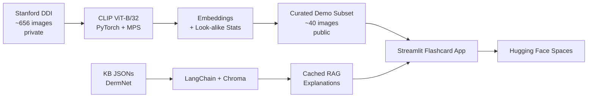

# derm-clip-rag

> An interactive dermatology study tool combining CLIP visual retrieval with LangChain RAG explanations.

<!-- TODO: replace with actual demo GIF once UI is built -->
<!--  -->

**Live demo:** https://huggingface.co/spaces/madwall/skin-sight-website

## What it Does

derm-clip-rag is an educational flashcard app for medical and pre-medical students learning to recognize common dermatological conditions. The user is shown a derm image and asked to choose the correct diagnosis from four options. **The wrong answer choices are not random — they are the conditions that a CLIP embedding model finds most visually confusable with the correct answer**, drawn from a precomputed look-alike analysis over the Stanford Diverse Dermatology Images (DDI) dataset. After answering, the app reveals the correct label, surfaces visually similar reference images with cosine-similarity scores, and shows a RAG-generated explanation comparing the user's chosen condition to the true condition — including key visual features, common look-alikes, and distinguishing features.

This is **not a diagnostic tool.** It is a study aid for recognition practice.

## Quick Start

```bash
git clone https://github.com/madigwall/derm-clip-rag.git
cd derm-clip-rag
conda env create -f environment.yml
conda activate derm-clip
streamlit run app.py
```

For full setup including dataset placement and the local pipeline, see [SETUP.md](SETUP.md).

## Architecture



Local pipeline runs once on the developer's machine. The deployed app reads precomputed artifacts (image embeddings, look-alike statistics, the Chroma KB index, cached per-flashcard explanations) and makes one live LLM call per user question in the "Ask Questions" chat.

**LLMs in this project:**
- **Live chat ("Ask Questions"):** OpenAI `gpt-4o-mini`, called from [src/derm/rag/answer.py](src/derm/rag/answer.py). Requires `OPENAI_API_KEY`.
- **Cached flashcard explanations:** generated *offline, one time* using local Ollama (`llama3.1:8b`) and committed to `data/public/rag_cache.json`. The deployed app does not call Ollama.

## Video Links

- **Demo video** (non-specialist, no code): _TODO_
- **Technical walkthrough** (code structure, ML techniques): _TODO_

## Evaluation

| Metric | Score |
|---|---|
| Top-1 retrieval accuracy | _TODO_ |
| Top-3 retrieval accuracy | _TODO_ |
| Top-5 retrieval accuracy | _TODO_ |
| Most common look-alike pair | _TODO_ |

Full methodology and results: `data/public/eval_results.json` and `notebooks/03_lookalike_analysis.ipynb`.

## Individual Contributions

Solo project by Madison Wall. All design, ML pipeline implementation, RAG knowledge base curation, UI, and documentation are mine. AI assistance disclosed in [ATTRIBUTION.md](ATTRIBUTION.md).

## Limitations & Future Work

- **Demo subset only in deploy.** Only ~40 curated images ship publicly; look-alike statistics displayed reflect analysis over the full dataset.
- **CLIP zero-shot baseline.** No fine-tuning; published accuracy is the realistic baseline for ViT-B/32 zero-shot on the chosen condition set.
- **English-language KB.** RAG explanations sourced from public DermNet content.
- **Not a diagnostic tool.** Recognition trainer only.

## License

The Stanford DDI dataset is governed by its own [Data Use Agreement](https://aimi.stanford.edu/datasets/ddi-diverse-dermatology-images) and is not redistributed by this repository. See [ATTRIBUTION.md](ATTRIBUTION.md) for citation requirements.
