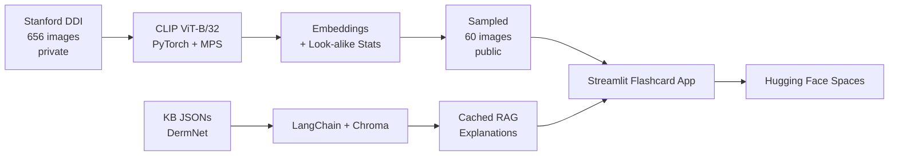

# SkinSight AI: Visual Dermatology Learning

>  SkinSight AI is an interactive study tool that helps students learn to visually diagnose skin conditions with more diverse representation than typical materials. It pairs CLIP visual similarity (to determine lookalike-based distractors) with RAG over DermNet (for grounded explanations).

**Web application:** https://madwall-skin-sight-website.hf.space/

⚠️ Disclaimer: This tool is for educational use only and is not a substitute for clincial advice.

## Project Motivation

Dermatology education materials underrepresent black and brown skin tones — a recent study found that only **10%** of images feature skin of color (Tadesse et al.). This may limit students' ability to diagnosis conditions, since most teaching has relied on lighter skin tone presentations (Kaundinya & Kundu). 

For dataset and other sources, see [ATTRIBUTION.md](ATTRIBUTION.md).

## What it Does

SkinSight AI offers two features: **flashcards** for diagnostic practice and a **live RAG chat** for asking questions grounded in clinical documents. Under the hood, a frozen CLIP ViT-B/32 image encoder embeds each DDI image into a 512-dim vector. This lets us use feature extraction to find the top-2 visually similar lookalike conditions which are used as the multiple-choice distractors. Both the cached flashcard explanations (generated offline by Llama 3.1 8B via Ollama) and the live chat (powered by OpenAI's gpt-4o-mini at runtime) are grounded by retrieval-augmented generation over a Chroma vector store of DermNet clinical articles. The only LLM call at inference time is the live RAG chat since CLIP similarity scores and explanations are precomputed.

## Quick Start

```bash
git clone https://github.com/madigwall/derm-clip-rag.git
cd derm-clip-rag
conda env create -f environment.yml
conda activate derm-clip
streamlit run app.py
```

For full setup, see [SETUP.md](SETUP.md).

## Video Links

- **Demo video** (non-technical introduction): _TODO_
- **Technical walkthrough** (for developers - focuses on code structure and architecture): _TODO_

## Evaluation

| Metric | Score |
|---|---|
| Top-1 retrieval accuracy | 28.8% |
| Top-3 retrieval accuracy | 60.3% |
| Top-5 retrieval accuracy | 72.6% |
| Most common look-alike pair | Seborrheic Keratosis and Melanocytic Nevi (12 mutual confusions)|

Full methodology and results: `data/public/eval_results.json` and `notebooks/03_lookalike_analysis.ipynb`.


DDI image counts per condition per Fitzpatrick group, after filtering to the top-7 conditions by sample count.

| Condition | FST I/II | FST III/IV | FST V/VI |
|---|---:|---:|---:|
| Melanocytic Nevi | 47 | 49 | 23 |
| Seborrheic Keratosis | 21 | 18 | 19 |
| Verruca Vulgaris | 26 | 7 | 17 |
| Epidermal Cyst | 16 | 5 | 14 |
| Squamous Cell Carcinoma In Situ | 15 | 10 | 3 |
| Mycosis Fungoides | 3 | 3 | 26 |
| Basal Cell Carcinoma | 7 | 34 | **0** |

Since there were no examples of Basal Cell Carcinoma on the FST V/VI group, in the UI we indicate that there was "No FST V/VI sample in DDI" placeholder rather than just hiding this group to indicate the underrepresentation in the sample.


### Design Choices
1. Educational tool vs. classification
-  I initially planned on improving classification accuracy of skin disease using a CLIP model. But I decided that with the small size of the training dataset (~656 images) and the fact that I wanted to improve representation in this space, that an educational tool better fit my goals.
2. CLIP image-encoder only vs. ResNet/CNN
- I used CLIP's image encoder only so embeddings would only be based on visual features, not condition labels. This better supported my goal of visual similarity search since I ensured that similarity wasn't based on the text description of a condition. Used CLIP's pretrained representations 
- CLIP's pretraning was on a larger, more diverse dataset. ResNets ignore features that may not help a specific classification task while CLIP forces encoders to preserve any feature which makes it more suitable for my feature extraction task. 

## Architecture



Local pipeline runs once on the developer's machine. The deployed app reads precomputed artifacts (image embeddings, look-alike statistics, the Chroma KB index, cached per-flashcard explanations) and makes one live LLM call per user question in the "Ask Questions" chat.

## Limitations

- **Conditions being visually similar isn't the same as being commonly confused clinically**. The photography of the image like lighting, scale, or skin tone could be contributing to why images of ocnditions are on average closer together rather than shape of lesions. These are visual lookalikes from CLIP not necessarily clinical lookalikes.
- **CLIP model doesn't have medical domain pretraining.** I could've used a CNN fine tuned on dermatology or a domain-specialized model to potentially produce more meaningful embeddings.
- **Only include seven conditions.** Some other major conditions like melanoma are not a part of the conditions used in this learning tool.
- **Missing data for BCC.** There are no images of people with darker skin tones who have BCC in this dataset so it would more difficult for people to learn how to diagnose this condition. 
- **KB is only based on DermNet.** Most of RAG explanations come from a single source or two sources for comparisons since there is one article on each condition in the KB. Incorporating articles from other sources like the AAD would make explanations more accurate.
